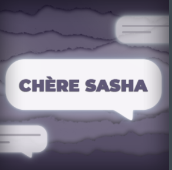

- ## Titre de l'oeuvre ou de la réalisation
   3 minutes

- ## Nom de l'artiste
  Les artistes sont Naoufal Bensaiad, Jérémie Lévesque et Samuel Poulin.

- ## Année de réalisation
  Ils ont réalisé l'oeuvre en 2021.

- ## Nom de l'exposition
  Ils ont exposé l'oeuvre à l'exposition des troisième année.

- ## Lieu de mise en expostion
  l'exposition se situait au Cégep Montmorency.

- ## Date de notre visite
  Je suis allé visité l'exposition de le 22 et le 24 mars 2021.

- ## Description de l'oeuvre ou du dispositif multimédia (citer sa source)
   L'oeuvre 3 minutes est en deux parties, la première est très amusante et la deuxième anxiogène. Pour les 3 première minutes de l'expérience vous jouez au ballon chasseur et pour les 3 autres minutes vous êtes dans le corps d'un enfant enfermé dans un casier et vous attendez des bruits et des enfant qui rigolent de vous. Cette expérience a pour but de démontrer que 3 minutes peut être différent selon la situation que vous êtes.
 
 
 

- ## Explication sur la mise en espace de l'oeuvre ou du dispositif(texte à composer)
 L'oeuvre se situe à deux endroit différent. Le premier endroit est très ouvert pour laisser de la place pour jouer au ballon chasseur, mais pour la partie du casier vous devez marcher dans un petit couloir et rentrer dans un faux casier pour que la deuxième expérience débute.

- ## Listes des composantes et techniques de l'oeuvre ou dispositif
  Pour les composantes et techniques de l'oeuvre l'équipe ont utilisé 2 projecteurs de lumière, des détecteurs de présence , 4 petits hauts-parleurs aux 4 coins du casier, un gros haut-parleur à l'extérieur du casier, un casque de réalité virtuelle oculus et deux manettes branché à un ordinateur portable. Pour les techniques utilisés nous pouvons remarquer qu'ils ont utilisés un logiciel de 3D pour créer le jeux et un logiciel sonore pour créer la bande sonore.
   
 
 
 
 
 
 
 

- ## Expérience vécue
  J'ai vécu deux expériences complétements différentes l'une de l'autre. Premièrement, c'était la deuxième fois que je portais un casque de réalité virtuel et j'avais beaucoup de difficulter à voir l'image sans mes lunettes. J'avais essayé avec mes lunettes, mais j'ai préféré les enlever, car je n'étais pas confortable. Apars ceci j'ai beaucoup aimé jouer au ballon chasseur, le jeux était fluide et très amusant. Pour la deuxième partie de l'oeuvre (le casier), j'ai été agréablement surpris, je me croyais vraiment dans un casier. Le casier était vraiment bien fait, les proportions étaient vraiment bonne et le son dans le casier était assez fort pour que l'expérience sois immersive.
  
  
  
  

- ## Ce qui m'a plus, vous a donné des idées et justification
  J'ai aimé que dans le jeux il y avait des (easter egg), des éléments cachés que quand l'intéracteur l'activait des choses qui, au lancement du jeux, n'étaient pas là, mais apparaît quand nous l'activons. J'aimerais recréer ceci dans mon oeuvre de troisième année, car ces (easter egg) permet à l'intéracteur le sentiment de vouloir plus découvrir.

- ## Aspect que je souhaiterais faire autrement ou ce que je changerais
  Dans le couloir, j'ai remarqué directement des écrans qui affiche un texte et des numéros à appeler en urgence, cela avait un peu (casser) l'expérience, car je savais déjà ce que je m'apprètais à faire. J'aurais peux-être mis un projecteur au dessus des écrans pour que quand nous finnissons l'expérience du casier une lumière éclair l'écran.
  
  
  | 1. 3 minutes                 | J'ai choisi de mettre le projet "3 minutes" à la première place, car il est pour moi le projet qui respecte le plus le thème du temps. L'idée d'utiliser le thème du temps en démontrant que 3 minutes peuvent sembler courtes dans une situation et dans une autre très longue. Aussi j'aime bien l'idée de faire le projet en réalité virtuelle, le fait d'utiliser le casque de réalité virtuelle permet d'accentuer la pression de la scène d'intimidation. C'est pour cela que je le mets à la première place.                             |      |
|------------------------------|-----------------------------------------------------------------------------------------------------------------------------------------------------------------------------------------------------------------------------------------------------------------------------------------------------------------------------------------------------------------------------------------------------------------------------------------------------------------------------------------------------------------------------------------|-----------------------------------------|
| 2. L'horloge de l'apocalypse | J'ai choisi de mettre le projet de "L'horloge de l'apocalypse" à la deuxième place, car il est pour moi le projet qui sensibilise le plus sur l'impact de l'Humain. J'adore l'idée d'utiliser un concept de "L'horloge de l'apocalypse" ,que je ne connaissais pas auparavant, pour démontrer les conséquences de l'Humain. Aussi j'ai trouvé ingénieux de leur part d'utiliser une horloge et ses aiguilles pour ajouter de l'interactivité. C'est pour cela que je le mets à la deuxième place.                                         |      |
| 3. Jeux temporels             | J'ai choisi de mettre le projet du "Jeux temporels" à la troisième place, car il est pour moi le projet le plus divertissant. À la visite, je m'étais directement dirigé vers le projet, car la borne m'intéressait beaucoup. Pendant la visite, j'ai pu comprendre la complexité de ce projet. Je ne pensais pas que ce projet demandait autant d'efforts et de connaissances. Cette oeuvre m'a donné l'envie de continuer le programme pour me rendre à ce projet.  C'est pour cela que je le mets à la troisième place.               |  |
| 4. Chère Sasha               | J'ai choisi de mettre le projet de "Chère Sasha" à la quatrième place, car il démontre un sujet très important, qui est l'acceptation et la dépression, en incorporant le thème du temps. Le projet inclue beaucoup d'interactivité et j'adore sa, mais je ne pense passer beaucoup de temps dedans. Les autres je sais que je vais les expérimenter plusieurs fois et avec mes amis, mais celui-là je pense que je vais le faire 1 fois et après je vais passer à d'autre chose. C'est pour cela que je le mets à la quatrième place. |    |
| 5. Chronaufrage              | J'ai choisi de mettre le projet "Chronaufage" à la cinquième place, car je ne comprends pas vraiment le projet. Je trouve le projet extrêmement beau, les peintures demandent beaucoup de talent, mais j'ai peur qu'ils n'arrivent pas à finir le projet. Aussi je ne comprends pas vraiment le lien avec le temps.C'est pour cela que je le mets à la cinquième place.                                                                                                                                                                   |        |
| 6. Distorsion collective     | Distorsion collective est un projet qui semble très intéressant, mais comme nous n'avons aucune ou presque aucune information. Pour cela, il est difficile d'aimer ce projet, aussi j'aurais aimé avoir une vidéo explicative du projet. Même si le projet à une très bonne idée, il est original et démontre les conséquences des cours en ligne, je pense que pour l'instant le projet mériterait la dernière place.                                                                                                                  |      |

Source:https://tim-montmorency.com/2022/index.html
  
  
