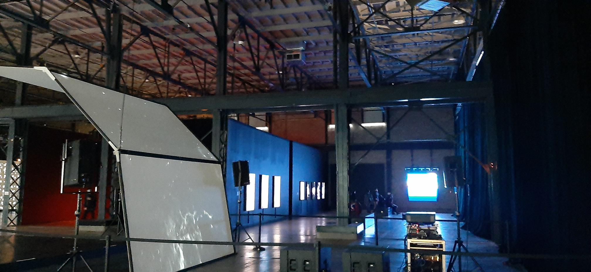
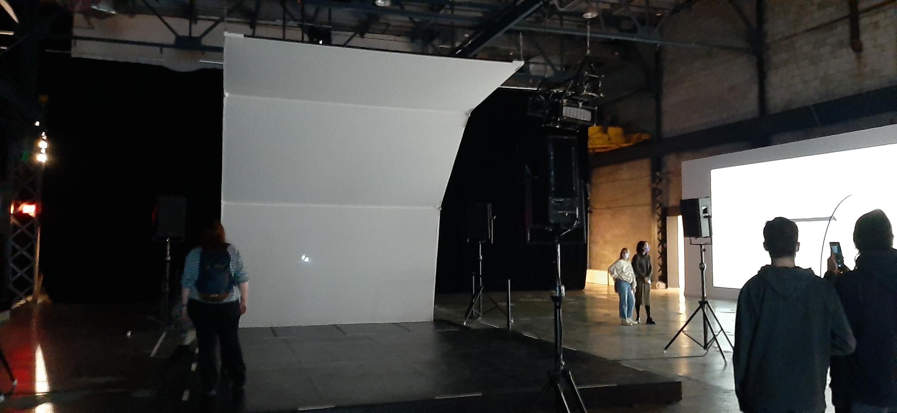
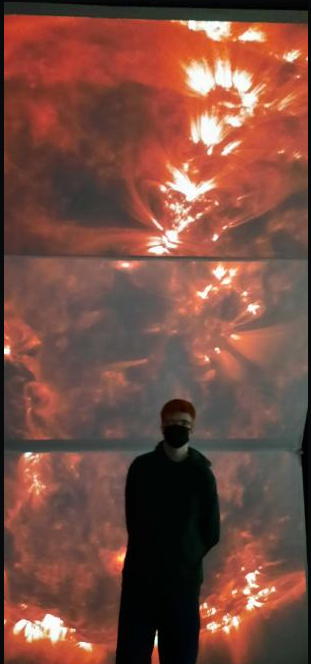

- ### Titre de l'oeuvre ou de la réalisation :
     Unfold

- ## Nom de l'artiste :
     Ryoichi Kurokawa

- ## Année de réalisation :
     2016

- ## Nom de l'exposition :
     Métarmorphosis Art Numérique & Imersif

- ## Lieu de mise en expostion :
     Arsenal Art Contemporain

- ## Date de notre visite :
     10 février 2022

- ## Description de l'œuvre ou du dispositif multimédia (citer sa source) :
     Inspirée des dernières découvertes dans le domaine de l'astrophysique, unfold, est une installation immersive et sensorielle, qui cherche à traduire en sons, images et vibrations les phénomènes entourant la formation et l'évolution des étoiles et galaxies.

- ## Explication sur la mise en espace de l'œuvre ou du dispositif (texte à composer) : 
     Unfold était disposé au centre droit de l'exposition et un grand espace était consacré a      elle. Trois écrans étaient disposés au-dessus d'une plateforme en bois et quatre hauts parleurs disposer a chacun des coins de la plateforme. Derrière la plateforme, il y avait un carré de clôture et à l'intérieur de celui s'il y avait 1 projecteur.
     
     
     
     

- ## Liste des composantes et techniques de l'œuvre ou dispositif :
     L'installation audiovisuelle de l'œuvre était constituée de 3 écrans accrochés par des câbles, 3 projecteurs HD accrochés sur des tuyaux au plafond, des caches câbles, 8 transducteurs, 4 enceintes sur des trépieds qui projetaient un son surround 6.1.1, une grande plate-forme en bois qui était par-dessus un système de vibration. Le système de vibration réagissait aux sons venant des enceintes.

- ## Expérience vécue :
     Quand je suis rentré dans l'exposition, Unfold était l'œuvre la plus massive et celle que l'on voyait en premier. Le son de la réalisation était excessivement fort ce qui a directement captivé mon attention. Après plusieurs minutes passées assis dans l'œuvre j'étais comment dire, hypnotisé. J'en conclus que j'ai vraiment passé un bon moment en regardant cette œuvre.

 
- ## Description de mon expérience de l'œuvre ou du dispositif, de l'interactivité et des gestes à poser :
     Cette œuvre est facile à comprendre techniquement parlant et très libre, vous pouvez vous coucher, être assis, debout et etc. Personnellement, la première fois, je m'étais assis, mais il était difficile de pouvoir regarder les 3 écrans en même temps. Donc, la deuxième fois, je me suis couché sur la plateforme et j'ai pu vraiment apprécier l'œuvre. Cette position amenait une sorte de renfermement sur nous-même, car nous ne voyons que les écrans et avec les 4 enceintes qui nous entourais elles rendaient l'expérience encore plus hors-du commun.

- ## Ce qui m'a plus, vous a donné des idées et justification :
     J'ai beaucoup aimé l'originalité de l'œuvre, Ryoichi Kurokawa a réussi à incorporer les phénomènes entourant la formation et l'évolution des étoiles avec une œuvre qui peut faire rêver autant les grands passionnés de l'astronomie et les gens comme moi qui ne connaisse aucunement ce sujet. J'aimerais dans mon projet de fin de programme, créer une œuvre qui peut plaire à un groupe précis d'individu, mais aussi à tout le monde.

- ## Aspect que je souhaiterais faire autrement ou ce que je changerais :
     Dans l'exposition, plusieurs fascicules étaient très difficiles à trouver. Ces fascicules représentent les pensées des artistes.

- ## Source :
https://artcollection.salford.ac.uk/ryoichi-kurokawa-unfold-alt/#:~:text=a%20fascinating%20synthesis.-,unfold.,evolution%20of%20stars%20and%20galaxies.
