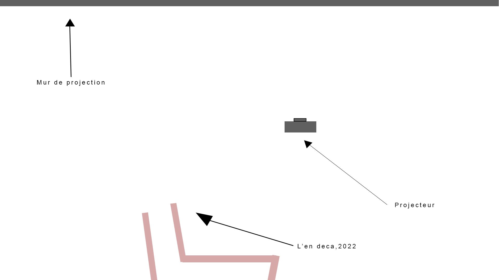

## Titre de l'oeuvre ou de la réalisation

LE FLEUVE, 50° 11′ 53,8” N., 66° 4′ 10″ O., 2022

## Nom des artistes

Catherine Béchard & Sabin Hudon

## Année de réalisation

En 2022

## Nom de l'exposition

Configuration

## Lieu de mise en exposition

La salle Alfred Pellan à la Maison des arts de Laval

## Date de notre visite

17 mars 2022

## Description de l'œuvre ou du dispositif multimédia (citer sa source)

L'œuvre est une composition en "loop" , de 32 minutes, venant de l'endroit où les eaux de la mer se confondent avec celle du fleuve, l'endroit se nomme la Pointe à Moisie. En fait, il s'agit d'un rassemblement de 4 vidéos différentes, projetés sur le mur, créant un effet hypnotisant ! Nous pouvons remarquer qu'il s'agit de 4 vidéos du fleuve tourné à la vertical.

## Explication sur la mise en espace de l'œuvre ou du dispositif (texte à composer)

L'œuvre, LE FLEUVE, 50° 11′ 53,8” N., 66° 4′ 10″ O., 2022, avait son espace à elle. L'œuvre qui la précédait, L'en deça.2022, guidait le visiteur directement devant la composition hypnotisante. Elle était situé au haut droit de la salle, un grand espace était dévoué à elle pour laisser les spectateurs s'asseoir, se coucher ou à leur guise.

## Listes des composantes et techniques de l'œuvre ou dispositif et des gestes à poser

L'œuvre n'avait besoin qu'un projecteur et qu'un mur pour la projection. Le projecteur était accroché au plafond.

## Expérience vécue

J'ai vécu deux expériences complétement différentes en regardant cette œuvre. La première fois, je m'étais assis et je n'avais pas tout de suite compris que c'était quatre vidéos du fleuve à la vertical. J'étais juste hypnotisé parle l'œuvre et j'admirais les formes. À la deuxième fois, cette fois, si je m'étais couché et l'expérience était complétement différente. Comme j'étais couché à la vertical, j'ai réellement pu voir les vidéos et réellement pu profité de l'expérience. En tant normal, sans l'école, je ne m'aurais jamais couché sur le sol pour regarder la projection, mais comme j'étais avec des gens que je connaissais, j'ai pris mon courage à deux mains et je me suis couché et grâce à sa la guide à prit une photo de nous. Grâce à cette expérience, j'ai pu comprendre que l'expérience devant une œuvre peut être différente selon l'angle que l'on la regarde.

## Ce qui m'a plus, vous a donné des idées et justification

J'ai aimé comment le mystère était présent dans l'œuvre, honnêtement sans aucune direction, je n'aurais jamais deviné que c'étaient 4 vidéos de fleuves et ça, j'aimerais peut-être le reproduire dans mon œuvre de troisième année. J'aimerais bien mettre l'intéracteur dans une position mystérieuse où qui peut lui même créer sa propre idée. Aussi, j'ai aimé que comparer aux autres oeuvres qu'ont a vu, que la démarche et les explications sur l'œuvre des artistes n'était pas compliqué. Unfold était une plateforme vibrante pour parler des étoiles, c'est un peu compliqué, mais eux ils disent vraiment ce que c'est, juste un fleuve.

## Aspect que je souhaiterais faire autrement ou ce que je changerais

Je pense qu'à revenir dans le passé, je m'aurais à côté sur les murs de L'en deça.2022, car je n'ai pas vécu l'expérience au maximum. À chaque fois, à cause des vibrations, quand je me penchais sur le mur, je pensais que le mur tombait par-derrière et je me relevais immédiatement. J'avais tellement peur de faire tomber la structure que je n'ai pas pu vivre l'expérience au maximum.

## Source :

Site : mariocloutierd.com

Lien : https://mariocloutierd.com/2022/03/04/arts-visuels-la-plastique-des-sens/?fbclid=IwAR2n4McrNl-PCeyWMKwQTZ5m8IicP-BFXLrFYfrzZIvoj3PIopQR3UEqTP8

Auteur et date : Sylvain Crampeau / 4 mars 2022

Site: bechardhudon.com

Lien : https://bechardhudon.com/             
