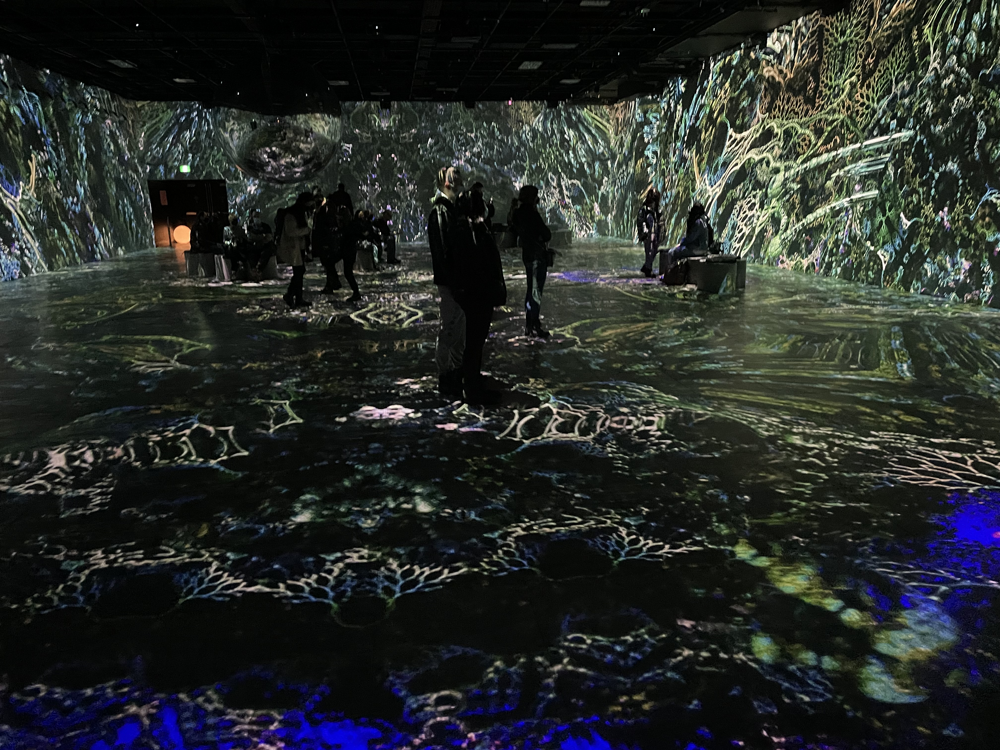
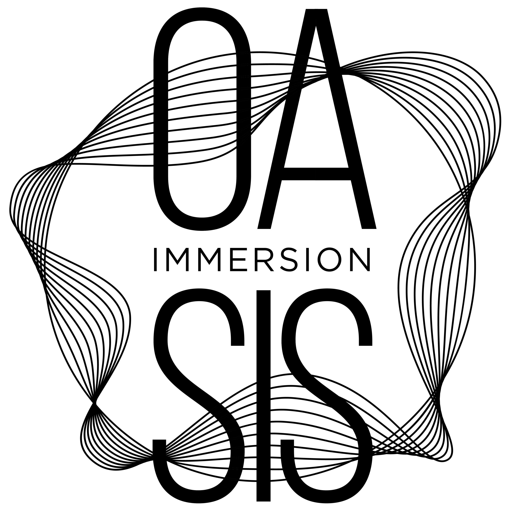
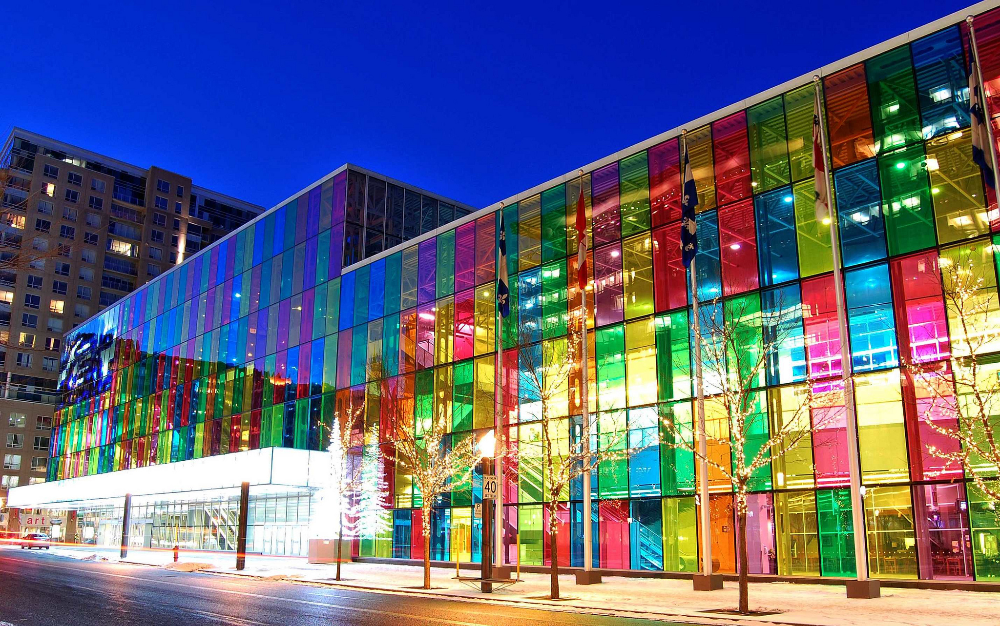
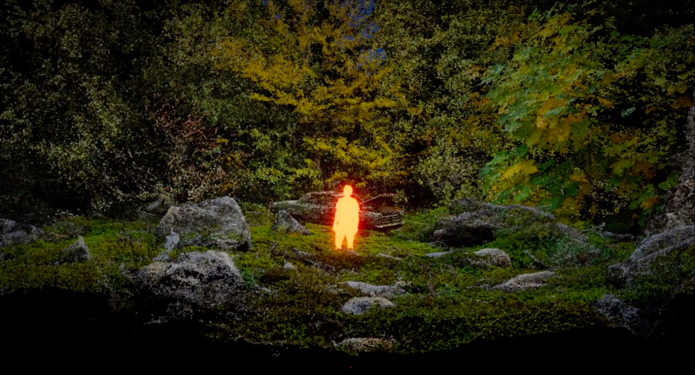
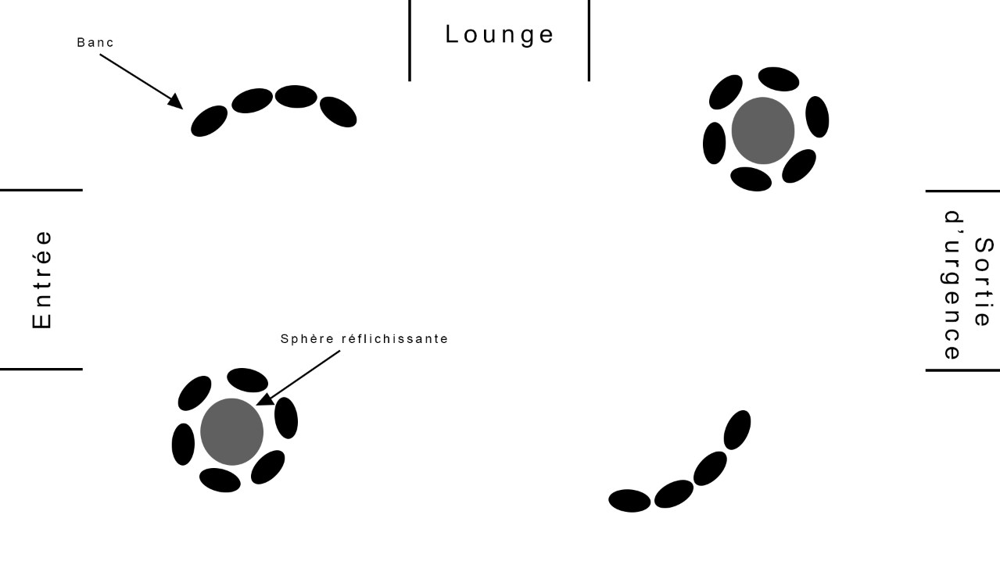
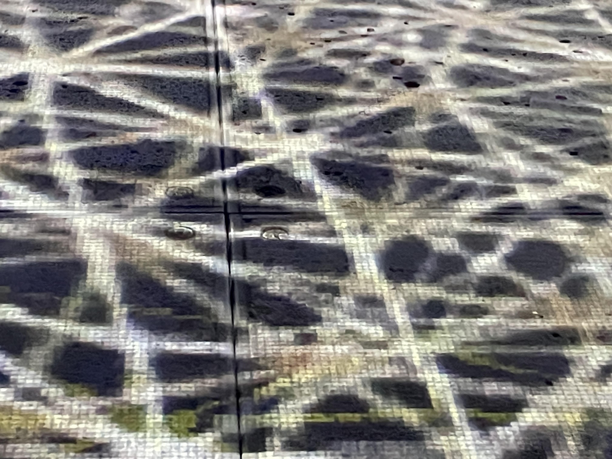
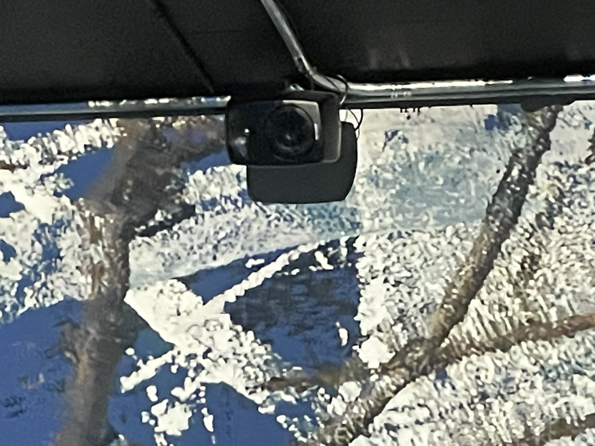
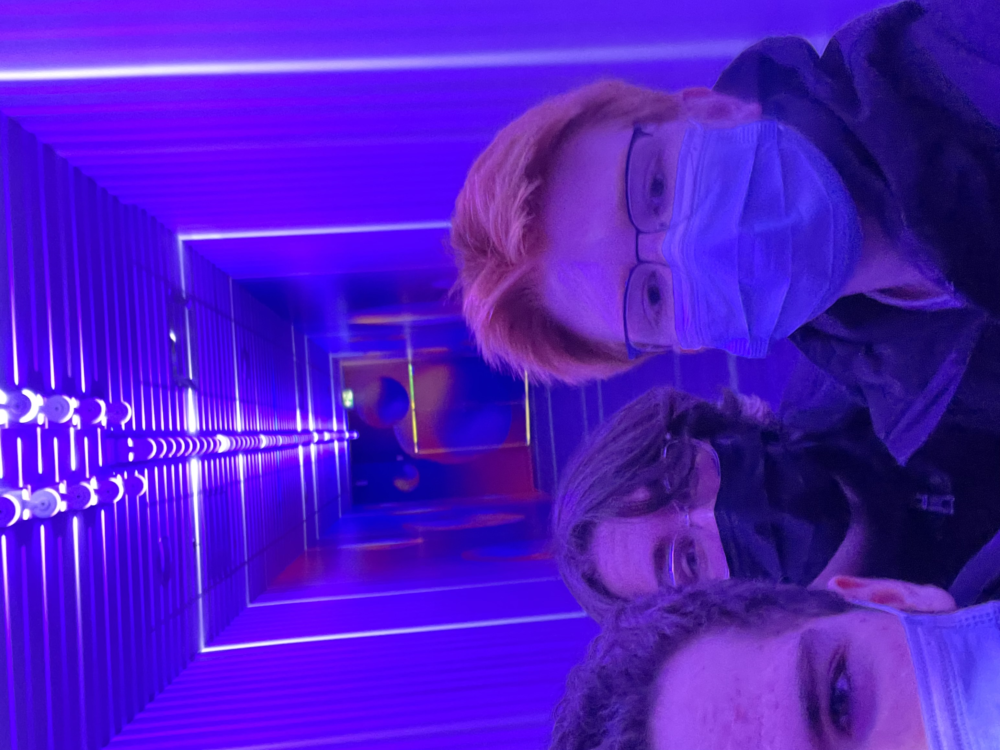
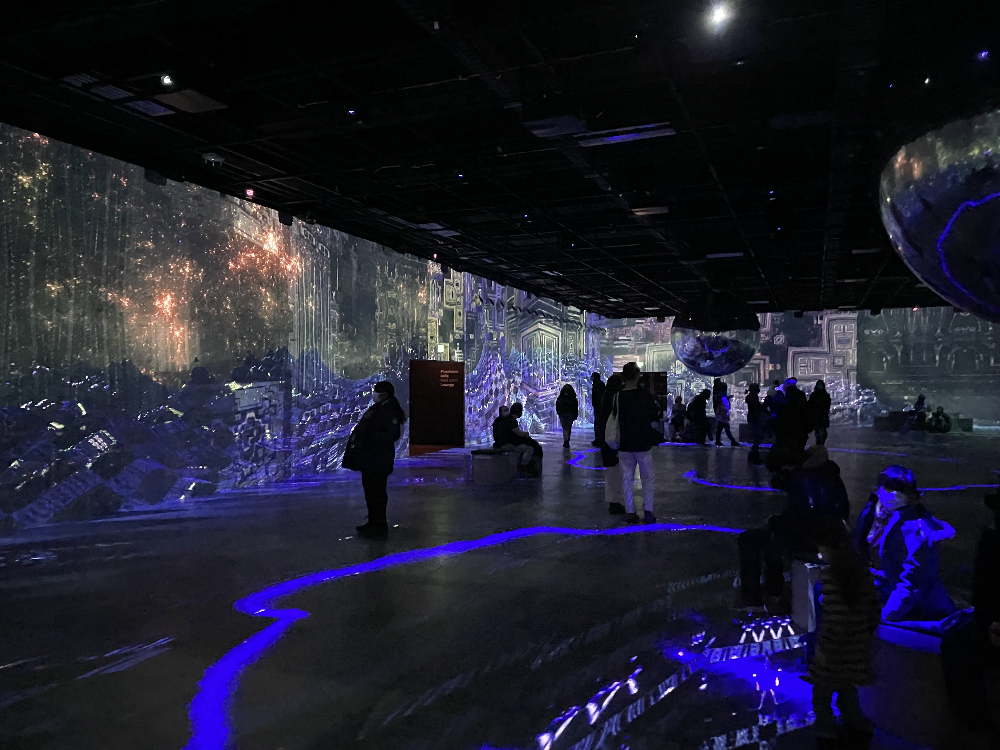

- ## Titre de l'oeuvre et nom des artistes
 L'ensemble des oeuvres se nomme Reconnexion, dans cet ensemble nous pouvons admirer l'oeuvre New Land créé par Alex Le Guillou, Recrusive Reflections créé par Julius Horsthuis et Flow du créateur Maotik.
 	
  
  

- ## Année de réalisation
 - Flow : Aucune date n'est cité dans le site de l'artiste. 
 - Recrusive Reflections : Aucun site est à notre disposition, donc aucune information est mentionné.
 - New Land : L'oeuvre à été créer en 2021.
 

- ## Nom de l'exposition
 L'exposition se nommait Oasis immersion.
 	

- ## Lieu de mise en expostion
 L'exposition se situait dans Les Galeries du Palais à Montréal.
 	

- ## Date de notre visite
 Nous avons visité l'exposition le 12 mars 2022.

- ## Description de l'oeuvre ou du dispositif multimédia
 - Flow :  Cette oeuvre est une installation interactive immersive qui s'inspire du " phénomène naturel des marées ". Cette oeuvre à pour but d'être abstraite pour permettre la libre interprétation des interacteurs. [flow](https://youtu.be/NexDQ-HeGDs)
 - Recrusive Reflections :  Aucune information est écrite sur l'oeuvre en tant que tel, mais plutôt sur l'artiste. Julius Horsthius utilise les mathématiques et les motifs géométriques. 	[recrusive_reflection](https://youtu.be/P8KUAvyrAck)
 - New Land : Cette oeuvre est une "expérience immersive audiovisuelle contemplative qui propose une réflexion sur notre environnement et la façon dont nous percevons la réalité". 	[new_land](https://youtu.be/AJssnlt3PA4)
  
  - Dans l'oeuvre New-Land nous pouvons retrouver la même technologie utilisé dans ,l'oeuvre What is Left of Reality de  Pierre Zandrowicz & Ferdinand Dervieux ,que nous avions eu la chance de voir la session passé dans le cour de Guillaume Arsenault. 	

- ## Explication sur la mise en espace de l'oeuvre ou du dispositif
  La salle comportait 3 portes, la porte de sortie, la sortie d'urgence et la porte entrée. Dans l'espace de l'oeuvre nous pouvons remarquer plusieurs bancs et deux énormes boules réflectantes suspendu au plafond. 	

- ## Listes des composantes et techniques de l'oeuvre ou dispositif
  L'expostion Oasis Immersion contait 105 projecteurs au laser et 119 haut-parleurs avec système audio ambiophonique et un ordinateur. Cependant, dans la troisième salles Reconnexion, il y avait de l'interactivité au niveau du plancher, donc nous pouvons supposer que sous le plancher il se trouve des détecteurs de mouvements. C'était la seul salle avec un plancher qui était amovible. L'artiste n'avait qu'à envoyer le fichier de son oeuvre à l'exposition. 

  
- ## Listes des éléments necessaires pour la mise en exposition.
 Pour la mise en exposition, comme cité plus tôt, l'artiste n'a besoin que d'envoyer le fichier contenant son oeuvre. Sinon, l'exposition n'a qu'à fournir les projecteurs, haut-parleur, ordinateur, détecteur de mouvement et finalement des éléments de décorations pour le plaisir des clients.

- ## Expérience vécue
  J'ai vécu une expérience formidable, les oeuvres comme l'immersion étaient incroyables, l'espace était très grande et nous laissait la liberté de marcher, être couché, être assis et autres. J'ai vraiment beaucoup été amusé quand j'ai découvert que quand je marchais, le sol changeais de position et me (fuyais). La seul chose qui a été négative pour moi et mes coéquipiés c'était qu'à la fin de notre visite nous avons eu un mal de tête, car les vidéos comportaient pour de couleurs et le son était très fort, mais apart ceci j'en retire que du bon. 	
  

- ## Description de mon expérience de l'œuvre ou du dispositif, de l'interactivité et des gestes à poser
Ces œuvres ne vous obligent pas à poser des gestes spécifique, mais plus tôt elle vous laisse la liberté de faire ce qui vous plaît. La seule chose qui est amusante et interactive à faire est de marcher dans la salle pour voir comment le sol change avec vos déplacements. [pas_interactivité](https://youtube.com/shorts/41WekFxDNPg?feature=share)

- ## Ce qui m'a plus, vous a donné des idées et justification
J'ai beaucoup aimé la liberté que l'exposition donnait aux intéracteurs. Je m'explique, l'exposition avait des grands espaces qui donnaient la liberté aux intéracteurs de s'asseoir comme ils veulent, de bouger et d'avoir de l'amusement. Donc, j'aimerais reproduire l'idée de liberté dans mes futurs projets.

- ## Aspect que je souhaiterais faire autrement ou ce que je changerais
Personnellement, je mettrais entre chaque salle des endroits comme par exemple des lounge pour relaxer notre cerveau ou juste de faire l'expérience plus courte.

- ## Source
- https://alexleguillou.com/New-Land
- https://congresmtl.com/recharger-unwind-un-voyage-sensoriel-qui-fait-du-bien/?msclkid=18109818c0b311ec8502a718a7c10820
- http://www.maotik.com/flow/?msclkid=223f4c5ac0b311ec8febd11bde1b0586http://www.maotik.com/flow/?msclkid=223f4c5ac0b311ec8febd11bde1b0586

